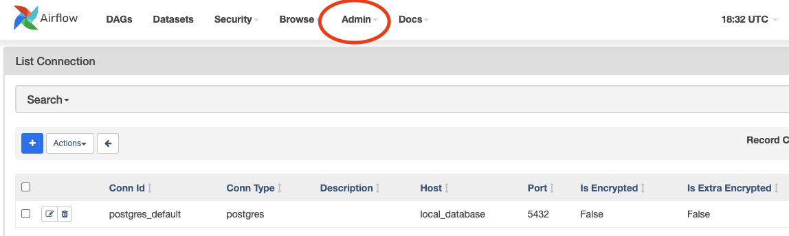
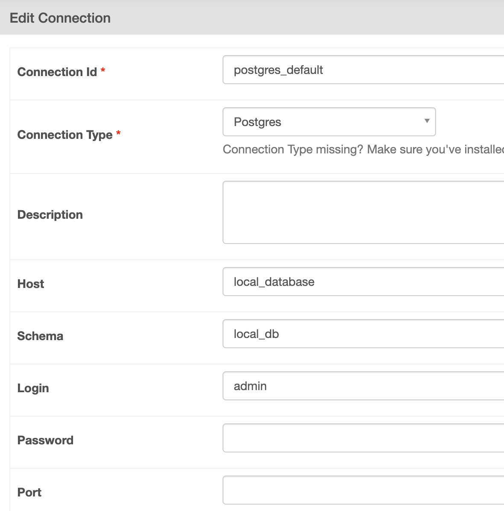
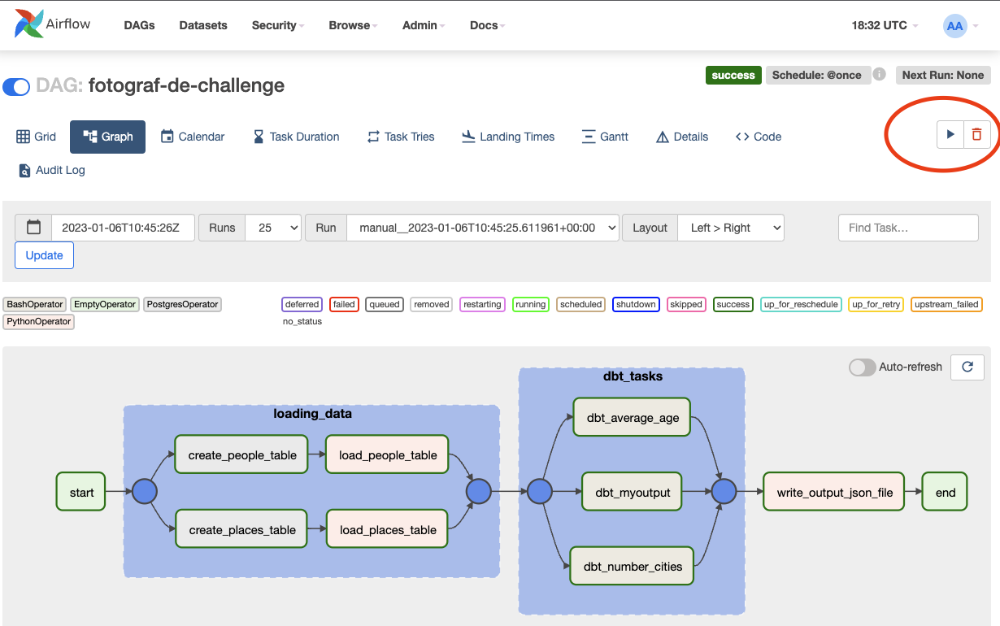

My idea was to build a "proper" ETL pipeline using Airflow that loads the data, and triggers dbt models for the transformations. This was to simulate a production-like pipeline and build a complete solution.

# Starting Airflow

Spin up the containers instance by running the command below (ignore deprecation warnings). **_NOTE:_** Please ensure no conflicting images in Docker running on the same port.  
```
make airflow-up
```

This will launch the Airflow instance, and separate local Postgres instance used in the ETL pipeline.

Airflow will be reachable at [localhost:8080](http://localhost:8080), via these credentials:
```
user: airflow
password: airflow
```

# Postgres Connection in Airflow

On the dropdown menu on top, Admin -> Connections, add a new Connection:



```
connection id: postgres_default
host: local_database (if fails, try: host.docker.internal)
port: 5432
schema: local_db
user: admin
password: admin
```



# Source data

The folder containing the two csv files (`data/` folder) are mounted in the volume.


# Running the DAG in Airflow

Simply run by clicking the "play" button. 



The DAG runs to create and load the raw tables, and runs the dbt models for the transformations. The final task creates the output file.

# Project folder

* SQL files used in the Airflow DAG can be found in this folder: `dags/sql/`
* The `dbt` folder contains the models used in the Airflow DAG.
* To interact with the codebase locally, create a virtual environment which installs the dependencies and switch to it.

```
make init-venv
```

# Database IDE
Connection settings in Dbeaver (or other IDE):

```
Postgres
host: locahost
port: 5432
database: local_db
username: admin
password: admin
```


# Notes on not using MySQL db

* I did create an instance of mysql, check out the `docker-compose.yml` file. This will be reachable with the credentials provided.
* However due to time limitations and problems with Docker in Mac M1 chip and Airflow as described [here](https://github.com/apache/airflow/discussions/25831), I went with Postgres. The SQL syntax and design would be similar anyway.
* I wrote a sample code to create and load a table in MySQL, check out `mysql_solution.py`. I again cannot run this locally, see [here](https://stackoverflow.com/questions/67876857/mysqlclient-wont-install-via-pip-on-macbook-pro-m1-with-latest-version-of-big-s). However, this code sample shows how I would have used the simple Python scripts.


# Running dbt outside of Airflow

If you want to trigger, firstly change to the dbt directory: `cd dbt`

Change `profiles.yml` host to `localhost`.

Check if setup is fine:
```
dbt debug
```

The models are in `dbt/models`. Run a sample model:
```
dbt run --select myoutput
```

This for example creates the table `public.myoutput`.

Clean the output files:
```
dbt clean
```

# Thought process:

* For simplicity and to avoid taking too many hours on the tasks; I hardcoded the connection settings and other configs. This is obviously not indicative of a proper development in the real world.
* I simply used the default `public` schema in Postgres for all tasks, again for simplicity.
* Raw & transformed tables created by the Airflow DAG:
```
public.people
public.places
public.myoutput
public.average_age (Average age of people in the city, no death date provided so most are above 100 years old.)
public.number_cities (Number of cities in the country).
```
* The final output file is written to `data/myoutput.json`.
* I created two additional simple dbt models, `average_age` and `number_cities` just to answer Task 2.
* The write-up talked about error handling and testing, the code and datasets are very shallow to require this, nevertheless I wrote instances of this in `dags/commons.py` as examples.

# Shutting down

To shut down Airflow and the container run:

```
make airflow-down
```
